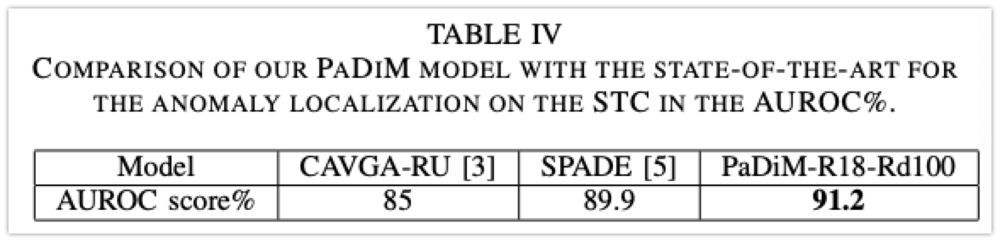
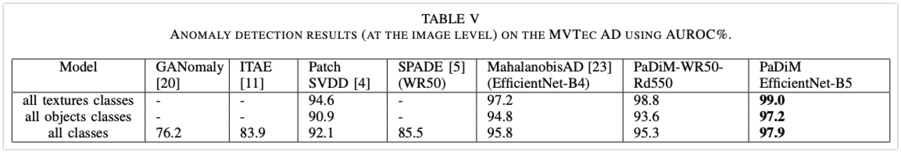

# PaDiM: a Patch Distribution Modeling Framework for Anomaly Detection and Localization

[Original Paper (Arxiv)](https://arxiv.org/pdf/2011.08785.pdf)

## Introduction

인간은 동일한 종류의 natural image 들 사이에서 종류가 다르거나, 특이한 패턴을 감지할 수 있다. 이러한 종류의 task 는 anomaly 혹은 novelty detection 으로 알려져 있으며, 산업계의 시각 검사 분야에서 매우 다양한 응용이 이루어지고 있다. 

하지만 실 산업 공정에서 anomalies 는 그 발생 빈도가 매우 적고, 일일이 탐지해내는것이 어려운 작업이다. 이에 이상 탐지 자동화는 집중력 감소를 최소화하여 균일한 품질 컨트롤을 가능하게 하며, 인간 작업자의 업무를 더욱 용이하게 할 수 있다. 

본 논문에서 저자들은 이상 탐지 (anomaly detection) 에, 특히 산업계 검사 측면에서의 anomaly localization 에 집중한다. 컴퓨터 비전 분야에서 이상 탐지는 이미지에 대해 anomaly score 를 부여하는 형태로 구성되곤 하는데, anomaly localization 은 더욱 복잡한 task 로, 각각의 픽셀 혹은 patch of pixels 에 대해 anomaly score 를 부여하여 anomaly map 을 형성한다. 그러므로 anomaly localization 은 더욱 정확하고 해석 가능한 결과를 보여줄 수 있다.

Anomaly detection 은 정상과 비정상 클래스 간의 binary classification 이다. 하지만 이 task 를 full-supservision 으로 학습하는 것은 불가능한데, anomalies 란 것은 전혀 기대하지 못한 패턴을 가질 수 있기 때문이다. 이에 anomaly detection model 은 종종 one-class learning setting 으로 처리되기도 한다. 

One-class learning: 학습 데이터가 오직 정상 이미지 클래스만을 포함하고 있고, 비정상 샘플은 학습 시 제공되지 않는다. Test time 에서 정상 학습 데이터셋과 다른 양상을 보이는 샘플은 비정상으로 분류된다.

최근 몇몇 방법론들이 one-class learning setting 에서 anomaly localization 및 detection task 에 대한 결과들을 보여주고 있는데, 까다로운 deep neural network 학습을 요구하거나 test time 에서 전체 학습 데이터에 대한 K-NN (nearest-neighbor) 알고리즘을 사용하기도 한다. K-NN 의 선형 복잡도는 데이터셋의 크기가 증가함에 따라 시간 및 공간 복잡도를 증가시키며, 이 두 scalability issue 는 산업계에서의 anomaly localization 알고리즘이 배치되는데 있어 (deploy) 방해 요소로 작용할 수 있다.

앞서 언급된 이슈들을 완화시키기 위하여, 저자들은 PaDiM (**Pa**tch **Di**stribution **M**odeling) 을 제안한다. PaDiM 은 embedding extraction 을 위해 pretrained 된 CNN 을 사용하며, 아래의 두 특성을 갖는다.

- 각각의 patch position 은 multivatiate Gaussian 분포로 표시된다.
- PaDiM 은 pretrained CNN 의 다른 sementic levels 간의 correlation 을 고려한다.

이렇게 새로운 접근 방식을 통하여, PaDiM 은 MVTec AD 및 STC dataset 에 대하여 anomaly localization 및 detection task 에서 현존하는 SOTA 를 모두 능가하는 성능을 보여주었으며, 또한 test time 에서 학습 데이터셋의 크기에 독립적으로 낮은 시간 및 공간 복잡도를 보여주었다. 더불어 저자들은 모델 성능 평가 과정을 확장하여 더욱 현실적인 조건에의 성능을 보여주고자 하였다. (예를 들어, 정렬되지 않은 데이터셋 등)

## Related Work

TBW

## Patch Distribution Modeling

### Embedding extraction

Pretrained CNN 은 anomaly detection 과 연관된 feature 를 출력하는데 사용될 수 있다. 이를 활용하여 저자들은 무거운 신경망을 최적화하는 대신, pretrained CNN 만을 사용하여 patch embedding vector 를 생성하였다. PaDiM 에서 사용한 embedding process 는 SPADE 의 그것과 유사하며, Figure 2. 에 묘사하였다.

학습 단계에서, 정상 이미지의 각 patch 는 pretrained 된 CNN activation map 에서 공간적으로 (spatially) 대응되는 activation vector 과 결합한다. 다른 layer 들에서 가져온 activation vector 는 concatenated 되어 서로 다른 level 의 semantic 과 해상도에 대한 정보를 담도록 하여, 보다 잘 정제되면서도 넓은 의미를 담을 수 있도록 하였다. Activation map 이 입력 이미지 대비 낮은 해상도를 가지면 많은 픽셀들이 같은 embedding 을 갖게 되며, original image 해상도에서는 겹치는 부분이 없는 pixel patch 들을 가지게 될 것이다. 즉 입력 이미지는 아래의

[[ (i, j) \in [1, W] \times [1, H] ]]

grid position 을 가지도록 나눌 수 있고, 여기서 $W \times H$ 는 embedding 을 생성하는데 사용된 가장 큰 activation map 의 해상도를 의미한다. 마지막으로, 각 patch position $(i, j)$은 위에서 계산된 embedding vector $x_{ij}$ 와 결합한다.

생성된 patch embedding vector 는 중복되거나 필요없는 정보들을 포함할 수 있기에, 그 크기를 줄일 수 있는 가능성에 대한 실험을 진행하였다. (Section V-A). 그 결과 기존 PCA 보다 ramdomly few dimension 을 선택하는 것이 더 좋은 성능을 보임을 확인하였다. 이러한 간단한 차원 축소는 training/testing time 에서 우리 모델의 복잡도를 매우 줄여줌과 동시에 SOTA 성능을 유지할 수 있도록 하였다. 마지막으로, 몇 장의 테스트 이미지로부터 얻은 patch embedding vectors 는 다음 subsection 에서 설명될 정상 클래스에 대해 학습된 parametric representation 을 활용하여 anomaly map 을 생성하는데 사용될 수 있었다.

### Learning of the normality

$(i, j)$ 위치에서의 정상 이미지 특성을 학습하기 위해, 저자들은 그림 2에서 보여준 방식으로 N 개의 정상 이미지로부터 $(i, j)$ 위치에 대한 patch embedding vectors 

[[ X_{ij}=\{x^k_{ij}, k \in \llbracket   1, N\rrbracket\} ]]

몇 개 샘플 set 을 계산하였다. 이 set 이 포함하고 있는 정보를 병합하기 위해 우리는 $X_{ij}$ 가 multivariate Gaussian 분포 $\mathcal{N} (\mu_{ij}, \Sigma_{ij})$ 로 부터 생성된다는 가정을 하였다. 여기서 $\mu_{ij}$ 는 $X_{ij}$ 의 sample mean 이며, sample covariance $\Sigma_{ij}$ 는 아래와 같이 계산된다.

[[ \Sigma_{ij}=\frac{1}{N-1}\sum^n_{k=1}(x^k_{ij}-\mu_{ij})(x^k_ij-\mu_{ij})^{\top} + \epsilon I ]]

Regularization 항 $\epsilon I$ 가 sample covariance matrix $\Sigma_{ij}$ 를 full rank 로 만들고, 역행렬 계산이 가능하도록 만들어 준다. 마지막으로, 가능한 각각의 patch position 은 그림 2에서 보여준 바와 같이 Gaussian parameters 행렬에 의해 multivariate Gaussian 분포와 결합한다.

Patch embedding vectors 는 여러 다른 semantic level 의 정보를 포함하고 있기에, 추정된 multivariate Gaussian 분포 $\mathcal{N}(\mu_{ij}, \Sigma_{ij})$ 각각이 여러 다른 레벨에 대한 정보를 포함하고 있음은 물론, $\Sigma_{ij}$는 level 간 correlation 을 포함한다. 저자들은 Section V-A 에서의 실험을 통하여, Pretrained CNN 의 서로 다른 semantic level 간의 관계를 모델링 하는 것이 anomaly localization 성능을 증가시키는데 도움을 준다는 것을 보여주었다.

### Inference: computation of the anomaly map

저자들은 [23] 및 [26] 에 영감을 받아, Mahalanobis distance [31] $M(x_{ij})$ 를 사용하여 주어진 test 이미지의 위치 $(i, j)$ 에 있는 patch 에 anomaly score 를 부여하였다. $M(x_{ij})$ 는 test patch embedding $x_{ij}$ 와 학습된 분포 $\mathcal{N}(\mu_{ij}, \Sigma_{ij})$ 간의 거리로 해석될 수 있으며, 아래와 같이 계산될 수 있다.

[[ M(x_{ij}) = \sqrt{(x_{ij}-\mu_{ij})^T \Sigma^{-1}_{ij} (x_{ij} - \mu_{ij})} ]]

그 후, anomaly map 을 형성하는 Mahalanobis distance 행렬 $M=(M(x_{ij}))_{1<i<W, 1<j<H}$ 을 계산할 수 있다. Map 에서의 높은 score 는 비정상 영역을 의미한다. 전체 이미지에 대한 최종 anomaly score 는 anomaly map $M$ 의 maximum 으로 계산 가능하다. 마지막으로, test time 에 저자들의 방식은 K-NN 과 같은 scalability issue 를 가지지 않으며, 1개 patch 의 anomaly score 를 얻기 위해 수많은 양의 거리를 계산하거나 정렬할 필요가 없다는 장점을 갖는다고 주장한다.

## Experiments

### Datasets and metrics

**Metrics.** Localization 성능을 얻기 위해 저자들은 두 개의 threshold-independent metric 을 계산한다.

- Area Under the Receiver Operating Caracteristic curve (AUROC): Ture-positive rate 의 의미가 "비정상으로 판정한 것들 중 실제로 비정상인 비율" 인 metric

AUROC 는 비정상이 많은 경우에 높은 수치가 나오도록 (in favor of large anomalies) 편중되어 (biased) 있기에, 저자들은 per-region-overlap score (PRO-score) 를 추가로 도입하였다. 

(확실하지 않음) 이는 각각의 연결된 요소로써 plotting 을 구성하는데, 옳게 분류된 pixel rates 에 대하여 false positive rate [0, 0.3] 의 구간에 대한 함수의 평균값에 대한 curve 로 표현할 수 있다. PRO-score 는 이 curve 의 normalized integral 로 볼 수 있다. 높은 PRO-score 는 크고 작은 비정상 구간 모두가 잘 포착 (localized) 되었다는 것을 의미한다.

**Datasets.** 저자들은 처음 MVTecAD 에 대해 모델을 검증하였고, 산업계 품질검증 (QC) 향의 one-class learning 설정에서 비정상 영역 탐지 알고리즘을 시험하고자 하였다. 데이터셋은 대략 15 개 classes 로 구성된 240개 이미지로 구성되었고, 원본 이미지 해상도는 최소 700 x 700 에서 최대 1024 x 1024 까지 이루어져 있다. 10 개의 object 와 5개 texture class 로 구성되는데, objects 들은 데이터셋 전반에 걸쳐 모두 중앙 및 방향 정렬이 되어 있는 상태이다. (그림 1 참조) 

원본 데이터셋에 더하여, 더 현실적인 차원에서의 비정상 영역 탐지 모델 성능 획들을 위해 저자들은 MVTec AD 의 변형 을 생성하고 Rd-MVTec AD 를 생성하였다. (-10, +10) 범위에서 rotation, (256x256 —> 224x224) 의 random crop 을 train/test set 모두에 적용한 단순 augmentation을 수행하였다. 이렇게 변형한 버전의 데이터셋은 품질관리 측면에서 보다 현실적인 케이스를 제공한다고 주장하는데, 이는 비정상 영역 탐지 문제에서 물체가 항상 중앙, 방향 정렬 되어 있지 않은 경우들을 커버 하기 위함이다.

추가 분석을 위해, 저자들은 PaDiM 을 STC Dataset 에 대해 테스트하였다. 이는 정적 카메라에서의 비디오 감시를 시뮬레이션 한 데이터셋인데, 274,515 개의 학습 프레임과 42,883 개의 테스트 프레임이 13개 신에 걸쳐 나누어진 데이터셋이다. 원본 이미지 해상도는 856x480 이다. Training video 는 normal sequences 로 이루어져 있으며, Test videos 는 보행자 구역에 차량이 존재한다거나, 사람들이 싸우는 등의 비정상적인 영상 내용이 포함되어 있다.

### Experimental setups

저자들은 PaDiM 을서로 다른 backbone 을 사용하여 학습하였으며, 모두 ImageNet pretrained 되었다.

- ResNet18 (R18)
- Wide ResNet-50-2 (WR50)
- EfficientNet-B5

[5] 와 같이, patch embedding vectors 는 ResNet 의 경우 첫 3개 layer 에서 추출하였다. 이는 서로 다른 semantic level 에서 정보를 추출하기 위함이며, 동시에 localization task 를 위해 충분히 높은 해상도를 유지하기 위함이었다. 이 아이디어를 따라서, EfficientNet-B5 에서는 아래 layer 에서 patch embedding vectors 를 추출하였다. 또한 random dimensionality reduction (Rd) 를 적용하였다. (V-A 참고)

- Layers 7 (level 2)
- Layers 20 (level 4)
- Layers 26 (level 5)

저자들의 모델 작명은 사용한 backbone 과 dimensionality reduction 방법을 나타내고 있는데, 예를 들어 PaDiM-R18-Rd100 은 PaDiM 모델을 ResNet18 backbone 과 100 randomly selected dimensions 로 설정하였다는 뜻이다. Epsilon 은 기본적으로 0.01을 사용하였다.

우리는 SPADE 모델을 논문 그대로 재현하였는데, backbone 은 Wide-ResNet-50-2 (WR50) 을 사용하였다. SPADE 와 PaDiM 에 대해 우리는 [5] 와 동일한 전처리를 적용하였다. MVRex AD 의 이미지를 256x256 으로 resize 하고, 224x224로 center crop 하였다. STC 의 경우 256x256 resize 만 사용하였다. Image 및 localization map 은 모두 Bicubic interpolation 을 사용하고, anomaly maps 에는 파라미터 $\sigma=4$ 의 Gaussian filter 를 적용하였다.

또, reconstruction-based baseline 을 위해 자체적으로 VAE 를 구현하였는데, ResNet18 을 encoder 로 하며 8x8 conv latent variable 을 갖도록 하였다. VAE 는 MVTec AD 클래스의 10,000 개의 이미지에 대해 아래의 data augmentation 작업을 거쳐 학습되었다.

- Random rotation (-2, 2)
- 292x292 resize
- random crop 282x282
- center crop 256x256

학습은 Adam 을 사용하여 100 epoch 도안 진행하였고, 초기 $lr=10^{-4}$로, batch size 는 32장을 사용하였다. Anomaly map 은 reconstruction 과 비교한 pixelwise L2 error 로 구성하였다.

## Results

### Ablative studies

먼저, 저자들은 PaDiM 에 대하여 아래의 두 가지에 대한 impact 를 검증하였다.

1. 사용한 sementic level 간의 correlation 영향력 
2. Dimensionality reduction 을 통해 저자들의 방법론을 보다 단순화 할 수 있는 가능성

**Inter-layer correlation.** Gaussian modeling 과 Mahalanobis distance 는 adversarial attacks 를 탐지하거나 [26], 이미지 레벨에서의 이상 탐지 [23] 를 위한 방법론으로 이전 연구들에서 적용되어 왔다. 그러나 이러한 방법들은 CNN의 서로 다른 semantic level 간 correlation 을 모델링하지 않았고, PaDiM 은 이러한 면에서 차별점을 가진다. 

표 1 을 보면, MVTec AD 에 대한 ResNet18 backbone 의 PaDiM 의 비정상 영역 탐지 성능을 보여준다.

- 처음 3개 layer 중 1개만 사용했을 때 (Layer 1, Layer 2, or Layer 3)
- 이 3개 모델의 출력을 모두 합하는 방식으로 ensemble 하여, 3개 레이어 모두 고려하지만 correlation 은 고려하지 않을 때 (Layer 1+2+3)
- PaDiM 에서 제안하는 방식 (마지막 row) 으로 각 patch location 이 ResNet18 의 첫 3개 layer 와 그들의 correlation 을 모두 고려한 one Gaussian 분포로 표현될 때 (PaDiM-R18)

Layer 3을 사용하는 것이 3개 layer 중에서는 AUROC 측면에서 가장 좋은 성능을 보여주는 것을 확인할 수 있는데, 이는 layer 3 가 '정상' 을 잘 설명할 수 있는 higher semantic level 정보를 포함하고 있기 때문이다. 그러나 layer 3 은 PRO-score 에선 Layer 2 보다 조금 낮은 성능을 보이는데, 이는 layer 2 의 낮은 해상도가 anomaly localization 의 정확도에 나쁜 영향을 끼쳤기 때문으로 추정할 수 있다. Table I 의 마지막 2개 row를 보면, 서로 다른 layer 들에서 정보를 병합하는 것이 high semantic information 과 high resolution 간의 trade off 이슈를 해결할 수 있는 것으로 볼 수 있다. (+왜? 설명 부족하지 않나?)

단순히 출력값을 합한 Layer 1+2+3 모델과 다르게, 저자들의 모델 PaDiM-R18 은 서로 다른 semantic level 간 correlation 도 고려하였고 그 결과, AUROC 에서 1.1p.p 만큼, PRO-score 에서 1.8 p.p 만큼의 성능 향상을 보였다. 이는 semanric levels 간 correlation 과 모델링의 관계를 입증하는 것이다.

**Dimensionality rediction.** PaDiM-R18 은 448 dimension 을 가지는 set of patch embeddings vector 각각으로부터 multi-variate Gaussian distribution 을 추정한다. emb edding vector의 크기를 줄임으로써 PaDiM 의 계산 및 메모리 복잡도를 줄일 수 있다. 저자들은 차원 축소를 위해 두 가지 방법을 시도하였다. 

1. 첫 번째는 PCA (Principal Component Analysis) 알고리즘을 사용하여 448 차원에서 100 or 200 차원으로 감소시키는 것이다.
2. 두 번째 방법은 random feature selection 으로, 학습 전 임의의 feature 를 저자들이 임의로 선택하는 것이다. 이 경우, 10개의 다른 모델을 학습하고 그 평균 score 를 취하는 방법을 사용하였다. 서로 다른 seed 에 대한 평균 AUROC 에 대한 standard error mean (SEM) 이 항상 $10^{-4}$ 와 $10^{-7}$ 사이에 존재할 때, randomness 가 결과를 바꾸지 않는다고 판단 할 수 있다.

표 2로부터 우리는 동일한 차원에서 random dimensionality reduction (Rd) 가 MVTec AD classes 전반에 걸쳐 PCA 대비, AUROC 에서 최소 1.3p.p 만큼, PRO-score 에서 1.2p.p 만큼은 높은 성능을 보임을 확인하였다. PCA 는 가장 높은 variance 를 갖는 차원을 선택하는데, 해당 차원들이 정상 클래스와 비정상 클래스를 구분하는데 큰 도움이 되지 않는 것이 하나의 원인일 수 있다.

표 2로부터 알 수 있는 또 다른 사실은, embedding vector 의 크기를 100 차원으로 randomly 감소시키더라도 anomaly localization performance 에는 거의 영향을 끼치지 않는다는 점이다. AUROC 에서는 0.4p.p 만큼, PRO-score 에서는 0.3p.p 만큼만읨 하락을 보였다. 이렇게 단순하고 효과적인 차원 축소 방식은 PaDiM 의 시간, 공간 복잡도를 현저히 감소시켰고, 이는 section V-D 에서 조금 더 자세하게 설명한다.

### Comparison with the SOTA

**Localization.** 표 3에서 우리는 MVTec AD 에 대한 비정상 영역 탐지 task의 AUTOR 와 PRO-score 를 모두 확인할 수 있다. 

공정한 비교를 위해, SPADE 에서 사용된 backbone 과 동일한 Wide ResNet-50-2 (WR50) 을 사용하였다. 또다른 baseline 들은 보다 작은 backbones 를 사용하기 때문에, 우리느 ResNet18 (R18) 또한 시도하였다. 우리는 PaDiM 에서 사용한 embedding vector size 를 550 에 100 까지 축소하여 WR50 및 R18 에 각각 적용하였다.

1. 먼저 PaDiM-WR50-Rd550 이 다른 모든 방법론들 대비 모든 classes 에 대하여 가장 좋은 성능의 PRO-score 및 AUROC 를 나타냄을 확인하였다. 매우 가벼운 모델인  PaDiM-R18-Rd100 또한 MVTec AD 클래스 전체에 대하여, 평균 AUROC 에서 최소 0.2p.p 의 격차로 가장 좋은 성능을 보였다. 
2. PaDiM 성능을 추가로 분석하자면, Object classes 에서 성능 격차는 작았는데, PaDiM-WR50-Rd550 에서 최고 성능을 보였으나 (+0.2p.p) SPADE 가 PRO-score 에서는 최고 성능을 보여주었다. (+1.8p.p).
3. 그러나 우리 모델은 특히 표면 (texture) classes 에서 좋은 성능을 보였는데, PaDiM-WR50-Rd550 은 texture classes 에 대해 바로 다음 best model 인 SPADE 를 4.8p.p:PRO-score, 4.0p.p:AUROC 만큼 능가한 평균 성능을 보여주었다. 
4. 또한 PaDiM 은 SPADE 와 비교하여 explicit 확률 모델을 학습할 수 있다는 점에서 차이를 보인다. 이는 특히 texture images 에서 효과적인데, object images 처럼 방향 혹은 중앙 정렬되어있지 않더라도 PaDiM 은 학습용 정상 이미지 전반의 통계적 유사성을 효율적으로 잡아낼 수 있기 때문이다.
5. 또, STC dataset 에 대해서도 PaDiM 을 검증하였을 떄, tempolar information 없이 가장 좋은 성능을 보였던 CAVGA-RU [3] 및 SPADE [5] 와 비교하였다. 표 4에서 보이는 바와 같이 가장 좋은 성능은 (AUROC) 저자들의 가장 간단한 모델인 PaDiM-R18-Rd100 에서 2.1p.p margin 을 갖는 상태로 획득할 수 있었다. 사실 이 데이터셋에서 이미지 내 보행자 위치는 매우 편차가 큰데, section V-C 에서 보였던 바와 같이 정렬되지 않은 데이터셋에 대해서도 잘 작동함을 확인하였다.

**Detection.** 우리 모델에서 출력한 anomaly score map 의 최대 score 를 취함으로써, 전체 이미지에 대한 anomaly score 를 부여하고 image level 에서의 anomaly detection 을 수행하였다. PaDiM 을 SPADE 와 동일한 조건인 WR50 와 EfficientNet-B5 에 대해 테스트 해 보았다. 표 5 는 우리 모델 PaDiM-WR50-Rd550 이 MahalanobisAD 의 EfficientNet-B4 를 제외한 모든 모델을 능가하는 성능을 보여주었다. PaDiM-EfficientNet-B5 의 경우 모든 모델을, 모든 class에 대한 AUROC 평균 대비 최소 2.6p.p 는 우월한 성능을 보여주었다. 또한 두 번째로 우수했던 모델인 MahalanobisAD 와 다르게, 저자들의 모델은 이미지 내 비정상 부위를 정확히 특정할 수 있는 anomaly segmentation 을 수행할 수 있다.

### Anomaly localization on a non-aligned dataset

Anomaly localization 방법론의 robustness 를 검증하기 위해, 저자들은 PaDiM 및 여러 SOTA 방법론 (SPACE, VAE) 을 Rd-MVTec AD 에 대해 학습하고 성능을 검증하였음을 section IV-A 에서 언급한 바 있다. 그 결과를 표 6에 표시하였다.

각각의 test 설정에 대해, 5개의 다른 버전의 데이터셋을 취득하기 위해 MVTec AD 데이터셋에 대해 다른 random seed 를 사용하여 5번 전처리를 수행하였다. (Rd-MVTec AD 1,2,3,4,5) 이후 취득한 결과들을 평균내고 표 6에 report 한 것이다. 결과에 따르면, PaDiM-WR50-RD550 이 표면 및 물체 class 들에 대해 PRO-score 및 AUROC 에서 모두 가장 좋은 성능을 보였다. SPADE 와 VAE 는 원본 MVTec AD 대비 RD-MVTec AD 에서 PaDiM-WR-RD550 보다 더 큰 성능 하락을 보였다. 각각 12.2p.p 및 8.8 p.p 로, PaDiM 의 5.3 p.p 보다 훨씬 큰 값이다. 이를 통해 non-aligned images 에 대해 저자들의 방법이 훨씬 robust 함을 확인하였다.

### Scalability gain

**Time complexity.** PaDiM 의 경우, 학습 시간 복잡도는 데이터셋 크기에 선형적으로 증가하는데, 이는 Gaussian parameters 를 추정할 때 전체 데이터셋을 사용하기 때문이다. 반면 Deep neural network 학습이 필요한 방법론들 대비 PaDiM 은 pretrained CNN 을 사용하므로 복잡한 신경망 학습은 필요하지 않다. 그리하여 MVTec AD 와 같은 작은 데이터셋에서는 매우 빠르고 쉽게 학습할 수 있다. 가장 복잡한 모델인 PaDiM-WR50-Rd550 의 경우에도 CPU (Intel CPU 6154 3GHz 72th) 를 사용하여 MVTec AD Classes 에서 150초, STC video scenes 에서 1500 가 소요되었다. 이 학습 과정들은 GPU 를 사용해서 forward pass 및 covariance estimation 부분에서 추가로 가속화될 여지가 남아있다.

반면 VAE 를 클래스 당 10,000 장의 이미지로 MVTec AD 에 대해 학습시키는 것은 NVIDIA P5000 기준으로 2시간 40분을 소요하였다. 

SPADE 는 학습이 필요한 파라미터가 없기 때문에 학습은 필요하지 않으나, testing 이전에 정상 training 이미지 전체에 대한 모든 embedding vector 를 계산하고 메모리에 보관해야 한다. 해당 벡터들은 K-NN 알고리즘의 입력이 되고, K-NN 이 SPADE 의 추론 속도를 매우 느리게 만든다. 이는 표 7에서 확인할 수 있다.

표 7에서, 우리는 main stream CPU (Intel i7-4710HQ CPU @2.50GHz) 를 사용하여 추론 시간을 측정하였다. MVTec AD 에 대하여, SPADE 의 추론 시간은 동일한 backbone 기준 PaDiM 대비 7배 가량 느린 값을 보였는데, 이는 NN search 의 계산 복잡도가 매우 높기 때문이다. VAE 의 경우, reconstruction-based model 에 가장 유사하며 가장 빠른 성능을 보였다. 그러나 저자들의 Simple model 인 PaDiM-R18-Rd100 은 동일한 order 를 가진다. 비슷한 복잡도를 가지면서도, PaDiM 은 VAE 를 매우 큰 성능차로 능가하는 것을 보여주었다.

**Memory complexity.** SPADE 및 Patch SVDD 와는 다르게, PaDiM의 공간복잡도는 훈련 데이터셋 크기와 무관하며 이미지 해상도에만 의존한다. PaDiM 은 메모리에 pretrained CNN 과 각 patch 에 연관된 Gaussian parameter 만을 필요로 한다. 표 8에서 SPADE, VAE 및 PaDiM 에 필요한 메모리 양을 기록하였다. 여기서 모든 파라미터는 FP32 로 가정하였다. 동일한 backbone 을 가정할 때, MVTec AD 에서 SPADE 가 PaDiM 낮은 메모리 소비를 보였다. 반면 STC 와 같이 큰 데이터셋에 SPADE 를 적용할 경우, SPADE 의 메모리 소비는 걷잡을 수 없이 늘어나는 반면 PaDiM-WR50-Rd550 은 7배 적은 메모리를 요구하였다. PaDiM 의 공간복잡도는 MVTec —> STC 로 데이터셋을 변경하는 경우, 이미지 해상도에만 영향을 받기 때문이다. PaDiM 의 한 가지 이점은 사용자가 backbone 과 embedding size 를 inference time, resource 제한과 같은 요구사항 기대치에 맞게 조정함으로써 쉽게 적용 가능하다는 점이다.

## Conclusion

저자들은 one-class learning 관점에서 비정상 탐지를 위해 distribution modeling 을 기반으로 하는 PaDiM 프레임워크를 개발하였다. PaDiM 은 MVTec AD 및 STC datasets 에서 SOTA 를 달성하였다. 또한 평가 대상을 비정렬 데이터에 대해 적용하였고, PaDiM 이 보다 현실적인 데이터에 대해 강인한 모델이라는 것을 보였다. PaDiM 은 적은 메모리 및 시간 복잡도를 요구하였고, 산업 분야에서 시각 품질 검사와 같은 다양한 응용에 사용될 수 있도록 사용하기 쉬운 모델로 제안되었다.
